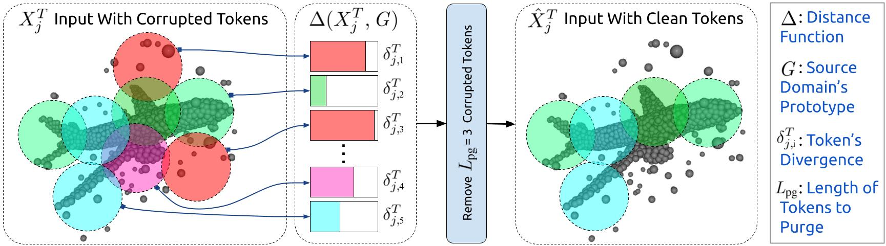

<h1>Purge-Gate - ICCV 2025 🎉 </h1>
<h3>Backpropagation-Free Test-Time Adaptation for Point Clouds Classification via Token purging</h3>

## Abstract

Test-time adaptation (TTA) is crucial for mitigating performance degradation caused by distribution shifts in 3D point cloud classification. In this work, we introduce Token Purging (PG), a novel backpropagation-free approach that removes tokens highly affected by domain shifts before they reach attention layers. Unlike existing TTA methods, PG operates at the token level, ensuring robust adaptation without iterative updates. We propose two variants: PG-SP, which leverages source statistics, and PG-SF, a fully source-free version relying on CLS-token-driven adaptation. Extensive evaluations on ModelNet40-C, ShapeNet-C, and ScanObjectNN-C demonstrate that PG-SP achieves an average of +10.3% higher accuracy than state-of-the-art backpropagation-free methods, while PG-SF sets new benchmarks for source-free adaptation. Moreover, PG is 12.4× faster and 5.5× more memory efficient than our baseline, making it suitable for real-world deployment.


## Overview

<div  align="center">    
 
</div>


# Preparation

## Installation
```
Instal the environment using these commonds:
conda create -n tta_purge python=3.10
conda activate tta_purge
conda install pytorch==2.4.1 torchvision==0.19.1 torchaudio==2.4.1 pytorch-cuda=12.1 -c pytorch -c nvidia

pip install -r requirements.txt


pip install -U 'git+https://github.com/facebookresearch/iopath'
pip install "git+https://github.com/facebookresearch/pytorch3d.git"
```

## Data Preparation
Our code currently supports three different datasets: [ModelNet40](https://arxiv.org/abs/1406.5670), [ShapeNetCore](https://arxiv.org/abs/1512.03012) and [ScanObjectNN](https://arxiv.org/abs/1908.04616).

### First Method: Create Corrupted Datasets 
For this work, you can use the code available in the [MATE GitHub repository](https://github.com/jmiemirza/MATE/tree/master)
  

### Second  Method: Download Corrupted Datasets 
You can download the corrupted datasets from the following [Google Drive link](https://drive.google.com/drive/folders/1v2VP-K0x0TIsPjpmJox6j-CgVPMLhe6Q?usp=sharing).


## Obtaining Pre-Trained Models
We have used the pre-trained models from [MATE](https://github.com/jmiemirza/MATE) method. Please download:

modelnet_src_only.pth

scan_object_src_only.pth

shapenet_src_only.pth

from 
this [Google-Drive](https://drive.google.com/drive/folders/1TR46XXp63rtKxH5ufdbfI-X0ZXx8MyKm) frolder and place them in the checkpoints directory in the project's root.


## Reproducing the results
To reproduce all the results, please run:
```
export CUDA_VISIBLE_DEVICES=<gpu_id>
bash commands.sh
```
Also, to reproduce the plots, please use the files in the lab directory.
## Acknowledgement

This project is based on Point-MAE ([paper](https://arxiv.org/abs/2203.06604), [code](https://github.com/Pang-Yatian/Point-MAE)), MATE ([paper](https://arxiv.org/pdf/2211.11432), [code](https://github.com/jmiemirza/MATE/tree/master)). Thanks for their wonderful works.


